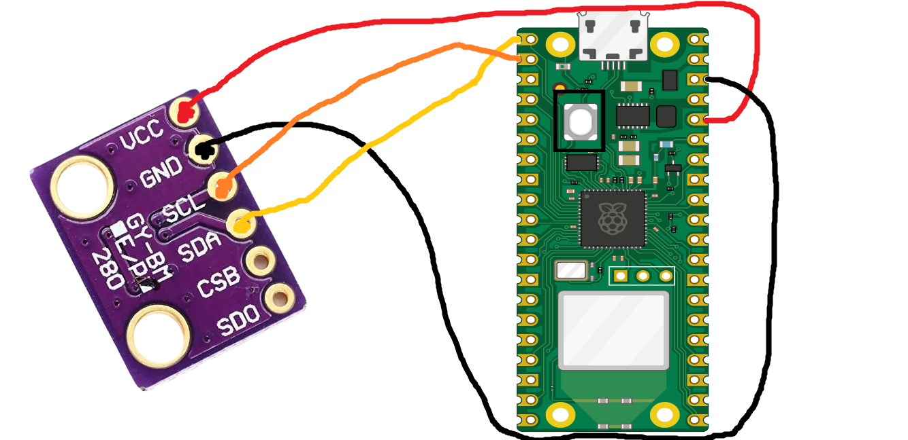
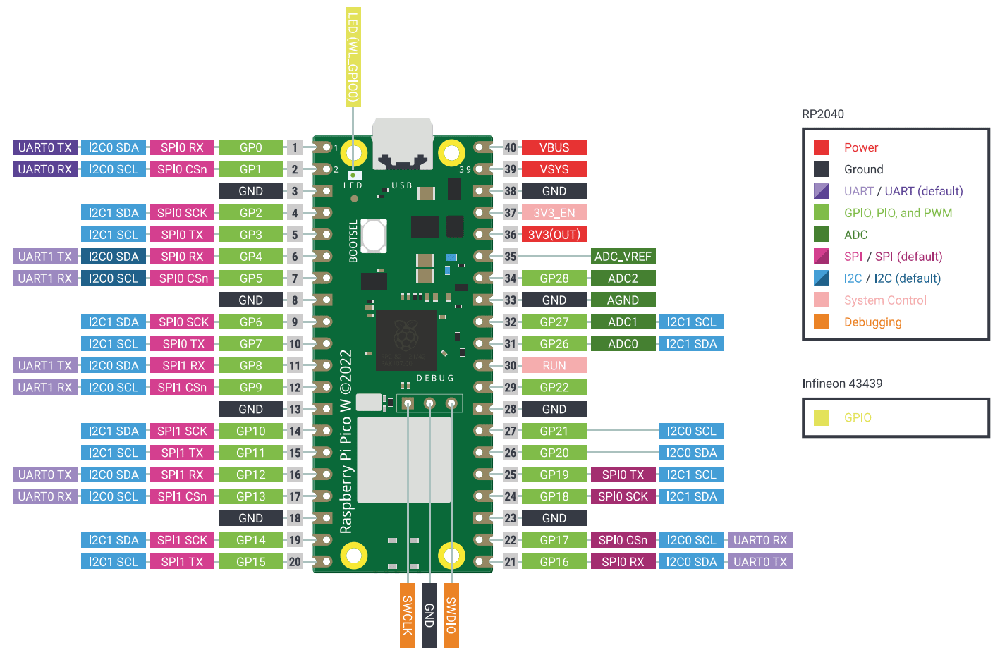

# Ponderada Semana 7
Nesta ponderada utilizamos o sensor O BMP280 que é um sensor de pressão barométrica e temperatura que pode operar em correntes extremamente baixas, como 2,7 µA a 1Hz, sendo um sensor ideal para aplicações móveis onde a economia de energia é crucial e pode ser interfaceado usando os protocolos SPI e I2C. O BMP280 contém um elemento sensor de pressão piezoelétrico resistivo. Este sensor envia dados para um ASIC (Circuito Integrado Específico para Aplicações) dentro do módulo. O ASIC envia dados sobre temperatura e pressão para dispositivos externos, como microcontroladores, nosso caso, o Raspberry Pi Pico W.

Conectamos o GDD e o VCC (este conectado no 3V3). No SCL do sensor, conectamos ao pino 2, que tem suporte a I2C SCL, conforme as pinagens do Raspberry Pi Pico W na imagem abaixo, e o SDA do sensor, conectamos ao pino 1, com suporte a I2C SDA.

A comunicação I2C entre o Raspberry Pi Pico W e o sensor BMP280 é um processo eficiente para a transferência de dados de sensoriamento, como as leituras de temperatura e pressão. Iniciando com a conexão física, apenas dois fios são necessários: um para a linha de dados serial (SDA) e outro para a linha de clock serial (SCL), simplificando a configuração do circuito. O Raspberry Pi Pico W, atuando como o dispositivo mestre, controla a comunicação ao enviar comandos para o BMP280, que possui um endereço único no barramento I2C, garantindo uma comunicação direcionada e sem interferências de outros dispositivos. A transmissão de dados ocorre de forma sequencial e sincronizada, com o sinal de clock regulando o fluxo de informações.

Durante a operação, o Raspberry Pi Pico W solicita dados de temperatura e pressão ao BMP280, que responde enviando as informações requeridas. Essa comunicação bidirecional permite não apenas a leitura de dados sensoriais mas também a configuração de parâmetros do sensor, como a calibração. O protocolo I2C se destaca pela eficiência na gestão de linhas de comunicação e pela capacidade de conectar múltiplos dispositivos em um mesmo barramento, mantendo uma estrutura simples e funcional. Isso torna o uso do BMP280 com o Raspberry Pi Pico W uma escolha popular para projetos de monitoramento ambiental e sistemas automatizados que requerem medições precisas de temperatura e pressão.

Quanto à visualização no serial dentro do PC, os dados lidos do sensor são enviados para a porta serial e podem ser monitorados usando um terminal serial no computador, nesse caso o Thonny, ambiente de desenvolvimento usado para programar o Raspberry Pi Pico W.

Videos: https://drive.google.com/drive/folders/1ivxteH3_c4zsk1qHZzgMpWLoakD7fuoU?usp=sharing
